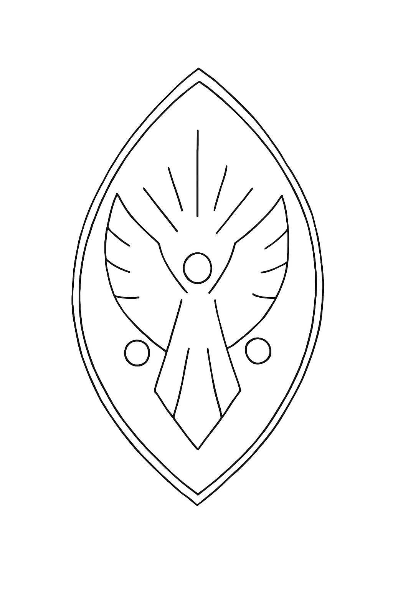
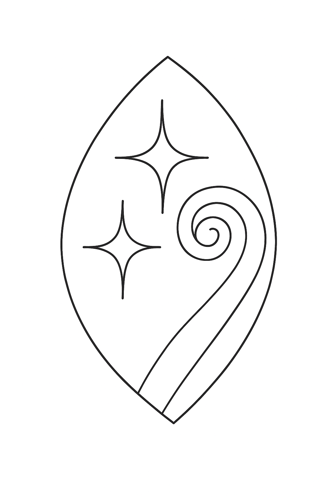
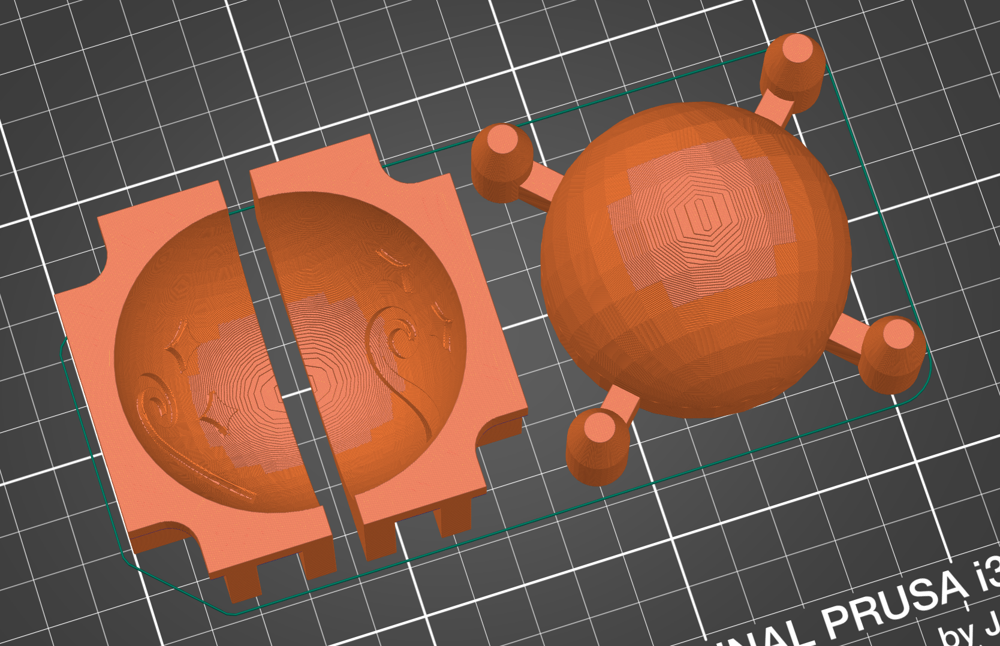

# Clay Mould for Jingle Bell with Design

A great project for beginners looking to make use of some wild clay to make some lovely gifts or just to have some fun with clay.

This project provides a simple buf effective ball mould for making a hollow sphere with a consistent size, shape and wall thickness that is very easy to operate.

Unlike a regular ball mould, this one has two designs already to go, for reproducibility:

- A stylised angel  (or, viewed upside down, a face with a moustache)
- A koru with a couple of stars

The angel design particularly require further sculpting.

## Clays I've used

Because it uses compression to form the shape, you can use even marginal clay, such as those without the plasticity that you might typically want for ceramics.

I've tried this with two wild clays that I've collected and tempered in different ways:

- A nice buff that stuck to my shoes once while out walking. Dry processed and tempered with white beach sand. Not plastic enough for most hand-building, but you could use it for coil pottery, but I couldn't make a lid from it. Polishes quite nicely with a smooth stone.

- A rich red terracotta I collected from the base of a bank close in my neighbourhood. Tempered with diotomaceous earth and added some boiled flour to boost plasticity. Pleasant to work with, polishes very nicely with a smooth stone.

## How to use the Ball Mould

1. Clamp the two concave halves together on a flat surface. Don't need much pressure.
1. Add a small square of plastic wrap diagonally on the mould; arrange it to try and avoid the locating pins.
1. Add a second small square of plastic wrap diagonally to the ball press.
1. (The sheets of plastic-wrap make mould release incredibally easy and you don't get any wrinkles.)
1. Insert a ball of clay into the lined mould.
1. Place the ball press on top, and push firmly down, until it can go no further.
1. Eject the ball press and remove the inner (top) layer of plastic wrap, which should be highly reusable.
1. Use a wooden knife or similar to cut off the excess against the mould.
1. Release the clamps from the mould and the mould will separate incredibally easily. Leave the ball-half to dry for a while.
1. Repeat. You now have two halves of a ball.
1. While the clay is still soft, you can add the ball half back to the ball press as an aid when adding design to the ball-half (eg. adding the detail to the angel).
1. Use some of your trimmings to make the ringer for the bell; a ball of clay about the size of a marble will do nicely.
1. When the ball halves are at a soft leather stage, trim around the outside edge to add a partial bevel to both halves. Score each with some slip, trying to avoid getting much slip inside the ball.
1. Before you assemble the ball, add your ringer. You can wrap in it small piece of tissue to help ensure it doesn't pick up other clay fragments (the tissue will burn away, although you won't be able to hear it rattle as it dries). I like to make my ringers in advance and let them dry.
1. Assemble the two halves together, ensuring you get the two halves oriented correctly. This is much easier when the clay is at the soft leather stage. Roll a thin worm of clay to integrate into the bevel and blend.
1. After an hour or so, when the slip has dried a bit, you can start adding your holes and other design elements. It's a good idea to punch one hole at least to equalise the pressure.

Tips:
- You'll find that clay is very satisfying to carve with a sharp knife; I use a small stiff whittling knife to cut the slots, typically in at least two sessions with a day of drying in between.
- Joining the two halves is so much easier when suitably dry. I find that if I leave the pieces on a wooden board, and cover loosely with some plastic, they'll be ready for use the next day, but I live in a temperate climate.
- After joining, I found my red clay can have various cracks in the surface. Don't panic, just place in a plastic bag, removing most of the air, and let it normalise for an hour or more. The outside will dry faster than the inside, so try and add holes and slots relatively quickly so it can breathe and relieve any stresses.
- When the clay is at the hard-leather stage, it can be **very** satisfying to polish it with a smooth stone.
- Remember, the bell will be quite fragile at this stage, particularly when you've cut in the slots.
- After a couple of days, you should be able to neaten your slots etc. Remember the ball will have been shrinking. I make these balls at a diameter of 55mm, and they shrink to about 50mm.

## How to create a mould

Requirements:
* OpenSCAD
* Inkscape (optional)
* Slicing software (I use Prusa Slicer)
* 3D Printer (I use an old Prusa i3 MK3)

Both the Angle and the Koru design are created from the same file, `jingle_bell_mould.scad`. Comment out lines at the bottom to select the design you want:

```
//print_set() ball_koru_stars();
print_set() ball_angel();
```

My initial sketches, showing a quarter of a sphere, after ChatGPT cleaned up my photos.

<p align="center">
    
    
</p>

The Angel design shows just raised embellishings, like if you were using an applique technique.

The Koru design show both raised and sunken embellishings; the sunken embellishings aid me in knowing where to cut through when cleaning up.

If you want to make your own designs, you can use Inkscape to create a suitable shape. Each shape needs to be an closed shape, not a path. Manually trace over the source image, avoid any tracing tools... and [Sep 2025] don't expect ChatGPT to make a useful SVG tracing.

When it comes to printing, the mould is sized for a 55mm ball, which will shrink to about 50mm. You should be able to update the `ball_diameter` variable appropriately, or resize it in the slicer.

I have printed this with a 0.2mm layer height on a speed setting. You could reduce layer height or try using variable layer height... the clay does pick up the detail at 0.2mm, but you can use tools like a moist sponge, a moist toothbrush, clay sculpting tools or a smooth stone to deal with that.


